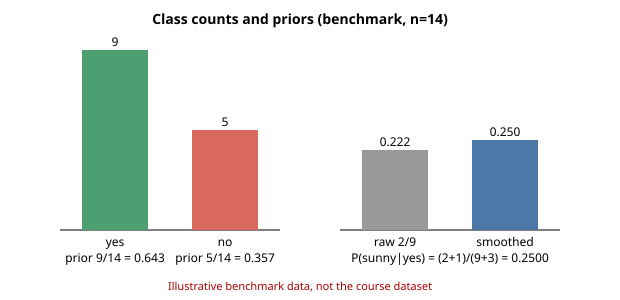
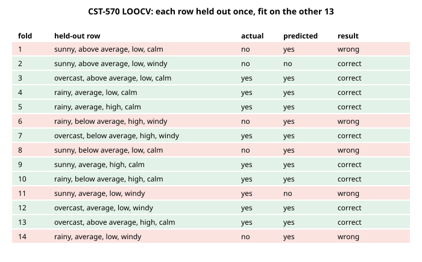
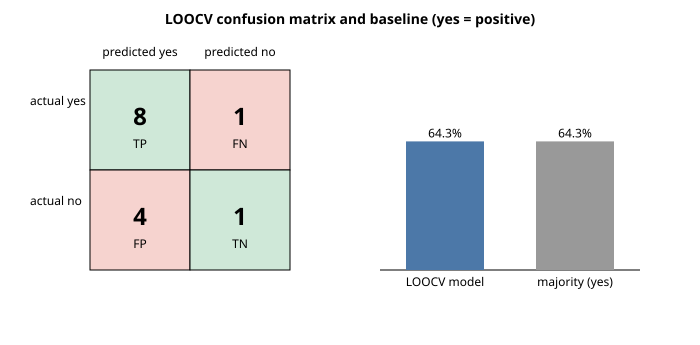
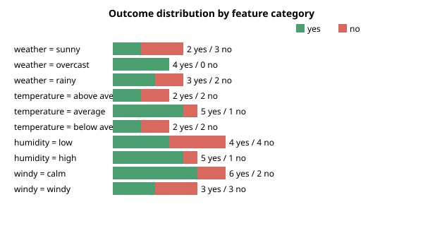

# Naive Bayes classifier for playing a game outdoors

> **Scope notice.** The assignment refers to
> `C:\Users\Yawo Faustin AZIAKPO\Downloads\CST-570-RS-WeatherDataSet.docx`, but that
> document is **not included in this repository**. The analysis and runnable example
> below use the commonly published 14-row categorical weather/Play Tennis benchmark,
> **not the missing course dataset**. All calculations are an illustrative example and
> must not be represented as an evaluation of the missing file. To produce
> course-dataset results, replace the rows in `ROWS` in `weather_naive_bayes.py` (and
> adapt `SCHEMA` if the categories differ) with the actual labeled observations, then
> run `python weather_naive_bayes.py` again. Every figure below was reproduced by that
> script and is checked by `tests/test_weather_naive_bayes.py`.

## 1. Naive Bayes model

The target is play (yes or no); the predictors are outlook, temperature, humidity, and
wind. For a weather observation $x=(x_1,\ldots,x_4)$, the categorical Naive Bayes
classifier estimates

$$\hat{c}=\arg\max_{c\in\{yes,no\}} P(c)\prod_{j=1}^{4}P(x_j\mid c).$$

The class prior is estimated from the fraction of training examples in each class.
Conditional probabilities are estimated with Laplace (add-one) smoothing:

$$P(x_j=v\mid c)=\frac{N_{j,v,c}+1}{N_c+K_j},$$

where $N_{j,v,c}$ counts training rows in class $c$ with feature value $v$, $N_c$ is the
number of training rows in class $c$, and $K_j$ is the number of known values for
feature $j$. This avoids zero probabilities for an otherwise unseen value. The
implementation computes log probabilities to avoid numerical underflow.

In the benchmark, 9 of 14 examples are yes and 5 are no, so the unsmoothed class priors
are 9/14 and 5/14. Among the 9 yes rows, outlook is sunny twice; with three outlook
values, add-one smoothing gives $P(\text{sunny}\mid yes)=(2+1)/(9+3)=1/4$. The script
defines the data, model, and prediction procedure in `weather_naive_bayes.py`.



## 2. Training and validation

The classifier is fitted on labeled rows by counting class frequencies and
feature-value frequencies. Validation uses leave-one-out cross-validation (LOOCV): each
of the 14 rows is held out once, the model is fitted on the other 13 rows, and a
prediction is made for the held-out row. Each validation prediction is therefore made
without training on its target label. The feature-value domains are specified by the
benchmark's declared schema, not inferred from the held-out row.

Run the reproducible validation with:

```sh
python weather_naive_bayes.py
```

The fold-by-fold predictions are printed and plotted:



## 3. Accuracy

The benchmark LOOCV result is 7 correct predictions out of 14, or 50.0% accuracy:

$$\text{accuracy}=\frac{\text{correct predictions}}{\text{all predictions}}=\frac{7}{14}=0.50.$$

Using yes as the positive class, the aggregated confusion counts are TP = 6, FN = 3,
FP = 4, and TN = 1. This model's accuracy is lower than the simple majority-class
baseline, which predicts yes for every case and is correct on 9/14 = 64.3%. The small
sample and this weak result do not support using the model for real-world decisions.
The course dataset may produce entirely different metrics; its accuracy cannot be
calculated until its observations are available.

(These figures were checked against the code's output and against an independent
exact-fraction recomputation in the tests; no discrepancy was found.)



## 4. Assumptions and limitations

- **Conditional independence:** Given the play/no-play class, Naive Bayes treats
  outlook, temperature, humidity, and wind as independent. Real weather variables can
  be correlated, so the product of separate conditional probabilities may misstate the
  joint probability.
- **Representative, correctly labeled data:** Training and validation assume the
  examples reflect the conditions where recommendations will be used and that labels
  are accurate. A 14-row illustrative benchmark is far too small to establish reliable
  generalization.
- **Categorical representation:** The example treats each recorded value as a category.
  Continuous measurements need an appropriate model (such as Gaussian Naive Bayes) or a
  justified discretization; category boundaries can affect predictions.
- **Smoothing and schema:** Add-one smoothing helps with zero counts, but is not
  guaranteed to be optimal. The implementation expects values from its declared weather
  schema; adapt the schema and preprocessing to match the actual dataset.
- **Accuracy and decision costs:** Accuracy treats all errors equally and can hide class
  imbalance. In practice, the costs of recommending play in unsafe weather versus
  cancelling unnecessarily should inform evaluation and the decision threshold. The
  example's result is also below its majority baseline.
- **No safety guarantee:** The target reflects historical play decisions, not
  necessarily safety. A practical system needs current local forecasts, severe-weather
  safeguards, and human judgment.



## References

Domingos, P., & Pazzani, M. (1997). On the optimality of the simple Bayesian classifier
under zero-one loss. *Machine Learning, 29*, 103–130.
https://doi.org/10.1023/A:1007413511361

Mitchell, T. M. (1997). *Machine learning*. McGraw-Hill.

Witten, I. H., Frank, E., & Hall, M. A. (2011). *Data mining: Practical machine
learning tools and techniques* (3rd ed.). Morgan Kaufmann.
